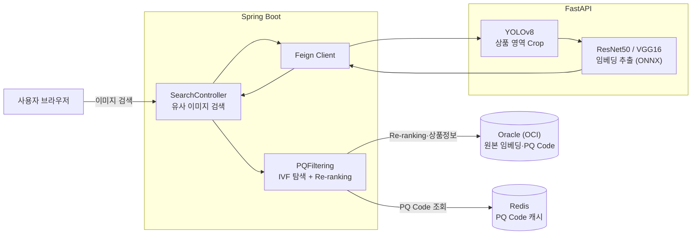
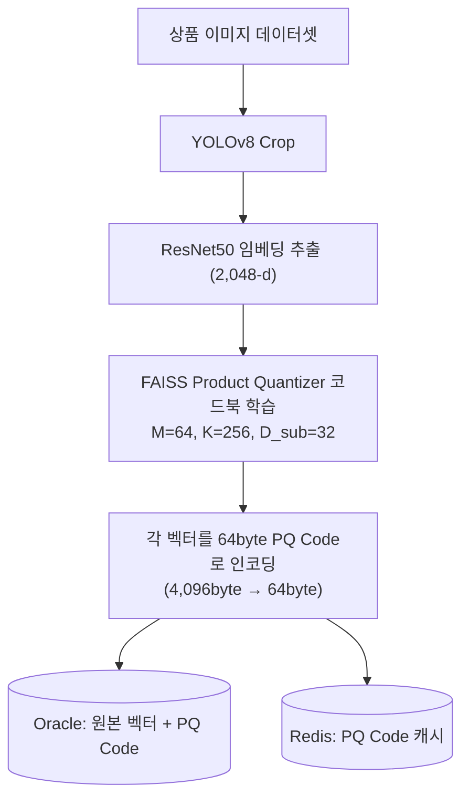
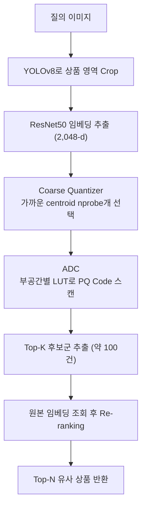
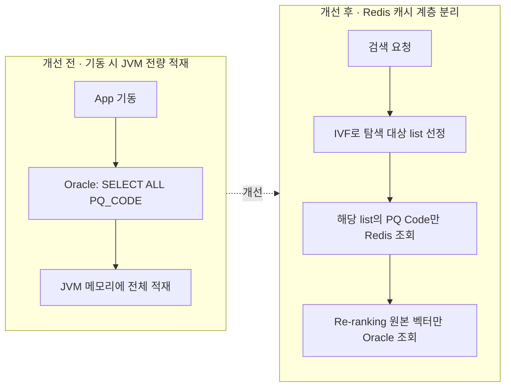

# 고속 이미지 검색을 지원하는 이미지 기반 추천 시스템

배포 주소 : [https://mekaive.com/search/findImg](https://mekaive.com/search/findImg)

저장소
- [RecommendSystem](https://github.com/jimins5042/RecommendSystem)(Backend) 
- [RecommandSystem_py](https://github.com/jimins5042/RecommandSystem_py)(ML)

## 프로젝트 소개

> **ResNet50 임베딩과 IVF-PQ 기반 ANN 탐색을 활용한 유사 이미지 추천 시스템**

- 현재 보고 있는 상품 이미지와 시각적으로 유사한 이미지의 상품을 보여주는 시스템
- ResNet50 모델로 추출한 임베딩 벡터를 IVF-PQ 방식으로 압축·인덱싱하여, 일정 수준의 정확도를 유지하면서 빠른 검색 속도를 보장

## 주요 기능

- **사전 학습된 ResNet50 모델을 활용한 임베딩 추출 및 압축**
    - 2,048차원의 임베딩 벡터를 64byte PQ Code로 압축하여 벡터 저장공간을 64배 절감
    - 배치 작업으로 주기적으로 코드북을 재학습한 뒤 전체 PQ Code를 재생성
- **IVF-PQ 기반 탐색을 활용한 유사 이미지 추천**
    - 질의 임베딩 벡터에 대해 각 부공간별로 256개 중심점과의 거리를 미리 계산하여 Lookup Table을 생성
    - IVF 탐색으로 후보군을 좁힌 뒤, 원본 임베딩 벡터를 조회하여 Re-ranking을 수행
    - 남은 후보 개수가 일정 이하가 되면 질의 이미지와 유사한 Top-N개의 상품을 선별

## 성능

- MAP@10 : 0.934
- MRR : 0.953
- Latency : 351ms
- 원본 대비 벡터 압축률 : 64배 (4,096byte → 64byte),
- 원본 대비 정보 보존율 94.6%

## 사용한 기술 스택

| 구분 | 사용 기술 |
| --- | --- |
| Language | Java 21, Python |
| Framework | Spring Boot 3.4.1, FastAPI |
| ML /  | ResNet50·VGG16 (ONNX Runtime), YOLOv8|
|벡터 검색| FAISS (IVF-PQ) |
| 데이터 접근 | MyBatis |
| DBMS | Oracle |
| 캐시 / | Redis, Spring Cloud OpenFeign |
| Infra | OCI |

 

## 구현 및 기술 도입 과정

### 용어 정리

**이미지 검색 (Image-to-Image retrieval)**

- 주어진 질의(query) 이미지를 기반으로 대규모 이미지 데이터베이스에서 유사한 이미지를 찾아내는 것을 목표로 함
- 내용 기반 이미지 검색(Content-Based Image Retrieval, CBIR)은 색상·질감·모양 등 시각적 특징을 분석하여 검색 결과를 반환하는 방식

**ResNet**

- Microsoft 연구팀이 개발한 모델로, 대규모 이미지 인식에서의 정확도와 효율성 덕분에 가장 영향력 있는 모델 중 하나
- 마지막 합성곱 레이어를 거쳐 2,048차원의 임베딩 벡터를 추출함

**IVF-PQ**

- 대규모 고차원 벡터 검색에서 탐색 범위를 줄이는 IVF(Inverted File)와 데이터 용량을 압축하는 PQ(Product Quantization)를 결합한 기법. 일부 정확도를 허용 가능한 수준에서 근사화하여 검색 속도를 향상시킴
- **IVF** : 전체 벡터 공간을 K개의 군집(centroid)으로 나눈 뒤, 질의 벡터와 가장 가까운 일부 군집만 탐색하는 방법
- **PQ** : 고차원 벡터를 여러 개의 부분 벡터(subvector)로 분리한 뒤, 각 부분 벡터를 코드북의 대표 벡터 인덱스로 대체하여 메모리 사용량을 압축하는 방법

### 요구사항

각각 2,048차원을 가진 수십만 개의 이미지 임베딩 벡터를 그대로 검색에 사용하면 저장공간과 검색 속도 측면에서 문제가 발생.
이미지 검색 방식을 도입하려면 아래 요구사항을 만족해야 함.

1. 신규 등록한 상품의 이미지를 비교하므로 매우 빠른 처리 속도를 보여야 함
2. 추천 상품 이미지는 질의 이미지와 시각적으로 유사한 특징을 보여야 함
3. 서버 및 인프라 자원을 과도하게 사용해서는 안 됨

### 탐색 방안

> **IVF-PQ 기반 이미지 검색 파이프라인 구축**

- ResNet50으로 추출한 고차원 임베딩 벡터를 IVF-PQ 방식으로 압축 및 인덱싱하여 검색 성능을 최적화
- 질의 벡터를 기반으로 ADC(비대칭 거리 계산)를 통해 Top-K개의 후보군을 빠르게 추출
- 벡터 압축 과정에서 일부 정보 손실이 발생하므로, 원본 벡터를 다시 조회하여 최종 유사도를 재계산하는 과정(re-ranking)을 통해 검색 정확도를 보완

### 임베딩 벡터 간소화

ResNet50 모델로 추출한 1개의 임베딩 벡터는 실수 타입(float16)의 2,048차원 데이터로 4,096byte의 저장공간이 필요.
이를 줄이기 위해 PQ(Product Quantization) 기법으로 벡터를 추가 압축함.

1. 이미지 데이터셋에서 ResNet50 모델로 임베딩 벡터를 추출함
2. 추출된 전체 임베딩 벡터에 FAISS의 Product Quantizer를 적용하여 K-means 기반 코드북을 학습함 (코드북 구조 `M=64, K=256, D_sub=32`)
3. 각 임베딩 벡터를 64byte PQ Code로 압축함
4. 최종적으로 모든 임베딩 벡터는 원본 대비 64배 압축된 64byte PQ Code로 표현됨 (4,096 → 64byte)

- 학습 데이터에서 무작위로 1,000장을 추출하여 압축에 따른 정보 손실을 측정한 결과, 원본 임베딩 정보의 약 94.6%가 보존되는 것을 확인
- 정보 손실은 (1) 원본 벡터를 PQ Code로 인코딩하고, (2) 코드북으로 복원한 뒤, (3) 원본 벡터와 복원 벡터 간 코사인 유사도를 계산하는 방식으로 측정함

### 검색 방법

1. 현재 보고 있는 상품 이미지의 임베딩 벡터를 모든 centroid와 거리 계산하여, 가장 가까운 centroid(nprobe개)를 선택
2. ADC로 선택된 centroid에 포함된 PQ Code와 거리를 계산하여 Top-K개의 후보군을 추출
3. 추출한 후보군의 원본 임베딩 벡터를 조회하여 re-ranking을 통해 최종 유사도를 측함

- **ADC(Asymmetric Distance Computation)** : 질의 벡터는 압축하지 않고, 부공간마다 256개 중심점과의 거리를 미리 계산한 Lookup Table을 만들어 PQ Code를 빠르게 스캔하는 방식

### 성능 측정 및 결과 분석

- `셀렉트스타`가 오픈데이터셋으로 공유한 상품 이미지 데이터셋을 이용해 성능 평가를 수행.
- 크라우드 유저들이 구글 검색을 통해 수집·가공한 가방·의류·선글라스·신발·식음료 이미지 41,895건으로 구성됨.
- 이 중 이미지 크기가 64×64px 이하이거나 임베딩 벡터가 비정상 추출된 이미지를 제외한 27,604건을 검색 대상 인덱스로 구축함. 이 인덱스를 대상으로 100건의 질의 이미지를 검색한 뒤, 각 질의의 상위 10개 결과에 대해 관련 이미지 여부를 사람이 직접 검증하여 지표를 산출함.

모든 지표는 상위 K=10 기준으로 측정함.

| 지표 | 설명 | 완전탐색 | IVF-PQ |
| --- | --- | :---: | :---: |
| Precision@10 | 상위 10개 결과 중 관련 상품이 차지하는 비율의 평균 (순위 미반영) | 0.8806 | 0.8726 |
| MRR | 첫 번째 관련 상품이 결과에서 얼마나 상위에 나타나는지 | 0.961 | 0.953 |
| MAP@10 | 관련 상품의 순위까지 반영한 질의별 Average Precision을 전체 평균한 값 | 0.9356 | 0.934 |
| Latency(ms) | 검색 완료까지 걸린 평균 시간 | 1,065 | 351 |

IVF-PQ 방식은 완전탐색 대비 정확도 지표(MAP@10, MRR)를 거의 그대로 유지하면서(정확도 손실 1%p 이내), 검색 지연을 약 67% 단축함(1,065ms → 351ms).
벡터 저장공간 또한 64배 압축하여 인프라 자원을 크게 절약함.

 

## 트러블 슈팅

### 이미지 내 다수 객체로 인한 검색 정확도 저하

**문제점**

- 상품 이미지에는 판매 대상 상품뿐만 아니라 소품·배경·기타 상품이 함께 포함되는 경우가 많음
- ResNet50 임베딩은 이미지 전체의 특징을 추출하므로, 주요 상품 외 객체나 배경의 특징이 함께 반영되어 구도만 유사한 이미지가 상위에 검색되는 문제가 발생함

**개선 방안**

- 파인튜닝한 YOLOv8 객체 탐지 모델로 상품의 Bounding Box를 검출
- 검출된 상품 영역만 Crop하여 배경 및 불필요한 객체의 영향을 최소화하고, 상품 중심의 임베딩 벡터를 생성하도록 검색 파이프라인을 개선

**결과**

- YOLOv8 학습 결과 mAP50-95(B) 90.83%를 달성하여 상품 영역을 안정적으로 검출
- 주요 상품 중심의 특징 벡터를 생성하도록 개선하여 ResNet50 기반 임베딩의 한계를 보완

### Redis 캐시 계층 도입을 통한 PQ Code 로딩 구조 개선

초기 구현에서는 애플리케이션 기동 시 Oracle에 저장된 모든 PQ Code를 조회한 뒤 JVM 메모리에 적재하고, 추천 요청이 들어오면 메모리에 적재된 전체 PQ Code를 대상으로 IVF 탐색을 수행함.
구현은 단순했으나 상품 수가 증가할수록 문제가 발생.

**문제점**

- 애플리케이션 기동 시 전체 PQ Code를 조회하고 inverted list를 구성해야 하므로, 상품 수 증가에 비례하여 기동 시간이 증가
- 여러 인스턴스가 동시에 기동될 경우 동일한 데이터를 반복 조회하여 데이터베이스 부하가 발생
- 코드북과 Coarse Quantizer를 재학습하면 모든 PQ Code를 다시 생성해야 하지만, 이미 메모리에 적재된 데이터의 갱신 여부를 구분하기 어려워 검색 결과의 일관성을 보장할 수 없음

**개선 방안**

- IVF 탐색 과정에서 선택된 inverted list의 PQ Code만 Redis에서 조회하도록 변경
- Redis는 조회 성능을 위한 PQ Code 전용 캐시 계층으로, Oracle은 원본 임베딩 벡터 저장소로 역할을 분리
    - Redis 데이터가 유실되더라도 Oracle을 기준으로 캐시를 재구성할 수 있도록 설계
    - 원본 임베딩까지 Redis에 저장하면 메모리 절감 효과가 사라지므로 re-ranking 단계의 원본 벡터는 RDB에서 조회
- 코드북 재학습 시 기존 PQ Code를 제거하고 새 PQ Code를 재적재하여 모든 인스턴스가 동일 기준의 데이터를 사용

**결과**

- 검색 시 필요한 PQ Code만 조회하는 구조로 전환하여 추천에 사용하는 메모리를 실제 탐색 범위 수준으로 줄이고 상품 수 증가에도 대응 가능한 확장성을 확보
- 탐색 단계(PQ Code)와 re-ranking 단계(원본 임베딩)를 분리하여 IVF-PQ의 메모리 절감 효과를 유지하면서 추천 정확도를 확보

 

## 설계 검증 — 상품 메타데이터 조회 인덱스 최적화

IVF-PQ 탐색 후 후보 이미지 100건의 메타데이터·상품 정보를 조회하는 SQL이 서비스 응답 시간에 미치는 영향을 검증.
`group_seq`(centroid)를 선두 컬럼으로 하는 복합 인덱스 도입 여부를 `EXPLAIN PLAN`과 `V$SQL` 통계로 비교.

| 구분 | (IMAGE_UUID, ITEM_ID) | (GROUP_SEQ, IMAGE_UUID, ITEM_ID) |
| --- | :---: | :---: |
| Plan Hash | 404668212 | 404668212 |
| IMAGE_INFO 접근 | TABLE ACCESS FULL | TABLE ACCESS FULL |
| SHOP_BOARD 접근 | TABLE ACCESS FULL | TABLE ACCESS FULL |
| 평균 실행시간(ms) | 42.8 | 43.1 |
| Buffer Gets | 5,483 | 5,470 |

- 현재 데이터 규모(IMAGE_INFO 27,604건, SHOP_BOARD 6,085건)에서는 Full Scan 비용이 인덱스 탐색 비용보다 낮다고 Optimizer가 판단하여 `TABLE ACCESS FULL`과 `HASH JOIN`을 선택함
- 실행시간과 Buffer Gets 모두 유의미한 차이가 없어 복합 인덱스를 적용하지 않음
- 다만 데이터가 수십만 건 이상으로 증가하거나 `group_seq` 기반 조회 비중이 높아지면 실행계획이 바뀔 수 있으므로, 증가 시점에 동일한 방법으로 재검증할 예정임

 

## 이전 유사 이미지 검색 방법

초기에는 VGG16 임베딩을 희소 인덱싱(LSH-MinHash / Bitwise AND)으로 검색했으나, 저장공간이 지수적으로 증가하고 파라미터 튜닝에 민감한 한계가 있어 ResNet50 + IVF-PQ 방식으로 전환함.

[VGG16 임베딩을 이용한 유사이미지 검색 방법](https://github.com/jimins5042/RecommendSystem/tree/master/readMe/README_v1.md)
